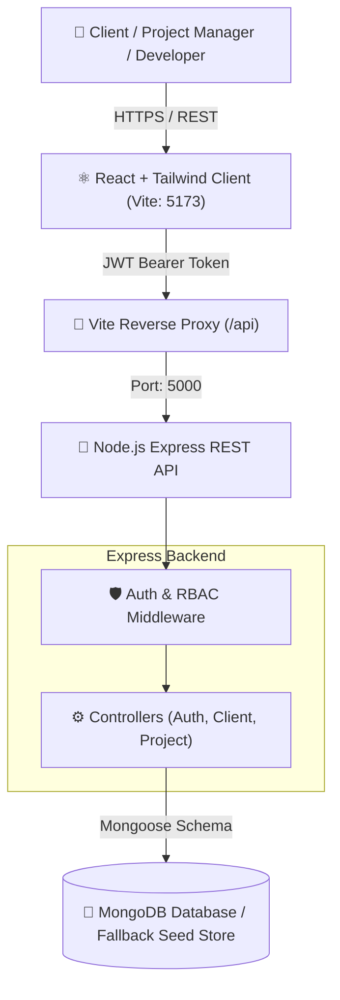

# 🚀 ClientScope — Enterprise IT Project & Milestone Delivery Portal

[](https://nodejs.org/)
[](https://react.dev/)
[](https://expressjs.com/)
[](https://tailwindcss.com/)
[](#architecture)
[](#)

> **Submission for 75WAY Technologies Campus Recruitment Drive 2027**  
> *Target Position: Software Development Engineer (Level II)*

---

## 📌 Executive Summary & Problem Solved

In modern IT service firms and custom software development agencies (such as **75WAY Technologies**), delivering projects to international clients requires transparency, rigorous milestone tracking, and tight budget control. Traditional spreadsheets lead to missed deadlines, milestone scope creep, and unclear billing statuses.

**ClientScope** is an end-to-end full-stack portal architected to streamline client engagement, milestone-driven development sprints, and real-time delivery tracking in a single, unified codebase.

---

## 🏗️ System Architecture

The project is structured as a **clean monorepo**, adhering strictly to the recruitment drive requirement that both frontend and backend live within the same repository.

```
clientscope-monorepo/
├── client/                     # Frontend Application (React + Vite + Tailwind CSS)
│   ├── src/
│   │   ├── components/         # Navbar, StatsOverview, ProjectCard, Modals
│   │   ├── context/            # AuthContext (JWT & Demo Session Handling)
│   │   ├── utils/              # Axios/Fetch API wrapper
│   │   ├── App.jsx             # Main Dashboard Container
│   │   └── main.jsx            # Entry point
│   ├── package.json
│   └── vite.config.js
│
├── server/                     # Backend REST API (Node.js + Express.js)
│   ├── controllers/            # authController, clientController, projectController
│   ├── models/                 # User, Client, Project (Mongoose Schemas)
│   ├── routes/                 # Express Route definitions
│   ├── middleware/             # JWT Verification & Role-Based Access Control
│   ├── data/                   # Resilient fallback mock store & seed data
│   ├── server.js               # Express application entry
│   └── package.json
│
├── .env.example                # Sample environment variables
├── .gitignore                  # Multi-layer git ignore rules
└── package.json                # Root orchestration scripts
```



---

## ✨ Key Features

1. **Role-Based Access Control (RBAC):**
   * **Administrator (`admin`):** Full system control — register clients, create/delete projects, manage team members.
   * **Project Manager (`manager`):** Update milestone delivery status, track progress, review deliverables.
2. **Interactive Milestone Progression:**
   * Dynamic calculation of project completion percentage `(Completed Milestones / Total Milestones * 100)`.
   * Real-time milestone status toggle (`pending` ➔ `in-progress` ➔ `completed`).
3. **Executive KPI Dashboard:**
   * Total Active Projects, Live Pipeline Contract Value ($), Milestone Completion Rate (%).
4. **Resilient Out-Of-The-Box Evaluation:**
   * Built with a dual data layer (MongoDB Mongoose schemas + in-memory resilient fallback store). The evaluator can clone and run the application **immediately without needing a local MongoDB daemon running**!

---

## 🔌 REST API Documentation

### Authentication (`/api/auth`)
| Method | Endpoint | Access | Description |
| :--- | :--- | :--- | :--- |
| `POST` | `/api/auth/register` | Public | Register new user account |
| `POST` | `/api/auth/login` | Public | Authenticate user & return JWT token |
| `GET` | `/api/auth/me` | Private | Retrieve logged-in user profile |

### Clients Management (`/api/clients`)
| Method | Endpoint | Access | Description |
| :--- | :--- | :--- | :--- |
| `GET` | `/api/clients` | Private | Retrieve all enterprise clients |
| `POST` | `/api/clients` | Private | Register new client account |
| `DELETE`| `/api/clients/:id`| Admin | Delete client account |

### Projects & Milestones (`/api/projects`)
| Method | Endpoint | Access | Description |
| :--- | :--- | :--- | :--- |
| `GET` | `/api/projects` | Private | Get projects (supports `?status=` & `?search=`) |
| `GET` | `/api/projects/:id` | Private | Retrieve project by ID |
| `POST` | `/api/projects` | Private | Create new project with milestones |
| `PATCH`| `/api/projects/:id/milestones/:mId` | Private | Toggle milestone status (`pending`/`completed`) |
| `DELETE`| `/api/projects/:id`| Admin | Delete project from repository |
| `GET` | `/api/projects/stats/summary` | Private | Executive stats summary for dashboard |

---

## ⚡ Quick Start Guide (Run Locally)

### Prerequisites
* **Node.js** (v18 or higher)
* **npm** (v9 or higher)

### 1. Clone & Enter Repository
```bash
git clone <YOUR_GITHUB_REPO_URL>
cd clientscope-monorepo
```

### 2. Install Dependencies
Run from the root directory to install both client and server dependencies:
```bash
npm run install:all
```
*(Alternatively, run `npm install` inside both `./server` and `./client` folders)*

### 3. Run the Monorepo (Concurrently)
```bash
npm run dev
```
* **Frontend:** [http://localhost:5173](http://localhost:5173)
* **Backend REST API:** [http://localhost:5000](http://localhost:5000)
* **API Health Check:** [http://localhost:5000/api/health](http://localhost:5000/api/health)

---

## 🔑 Default Credentials for Evaluation

For rapid evaluation, the application includes a **1-click Role Switcher** in the top navigation bar, or you can log in directly with:

* **Admin Role:**
  * **Email:** `admin@75way.com`
  * **Password:** `admin123`
* **Manager Role:**
  * **Email:** `pm@75way.com`
  * **Password:** `admin123`

---

## 🛡️ Security Best Practices Implemented
* Password hashing using **`bcryptjs`** with salt factor 10.
* Stateless session authorization using **JSON Web Tokens (JWT)** transmitted via `Authorization: Bearer <token>` headers.
* Strict CORS configuration isolating unauthorized origins.
* Environment segregation via `.env` with fallback defaults.

---

## 👨‍💻 Candidate Information
* **Applicant:** Aashray Narang
* **Target Role:** Software Development Engineer (Level II)
* **Drive:** 75WAY Technologies Virtual Campus Recruitment 2027
