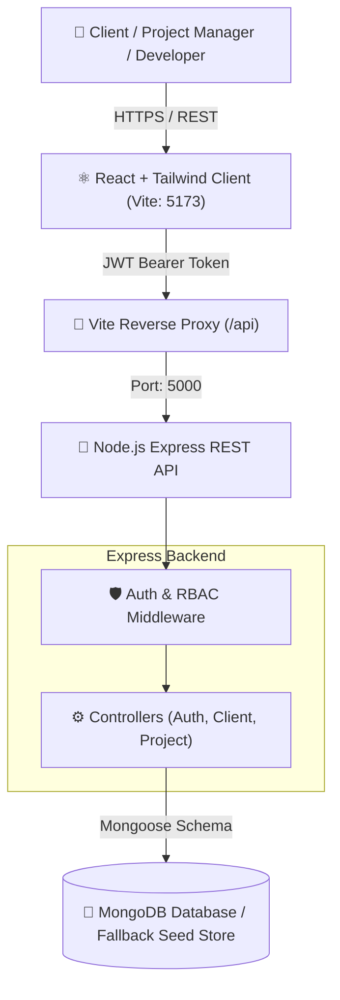

# 🚀 ClientScope — Enterprise IT Project & Milestone Delivery Portal

[](https://nodejs.org/)
[](https://react.dev/)
[](https://expressjs.com/)
[](https://tailwindcss.com/)
[](https://clientscope-delivery-portal.vercel.app)
[](#architecture)
[](https://opensource.org/licenses/MIT)

> **A modern, full-stack enterprise client project management & milestone delivery tracking platform.**  
> 🌐 **Live Demo URL:** [https://clientscope-delivery-portal.vercel.app](https://clientscope-delivery-portal.vercel.app)

---

## 📌 Executive Summary & Problem Solved

In modern IT service firms, software consultancies, and digital agencies, delivering projects to international clients requires transparency, rigorous milestone tracking, and tight budget control. Traditional spreadsheets lead to missed deadlines, milestone scope creep, and unclear billing statuses.

**ClientScope** is an end-to-end full-stack portal architected to streamline client engagement, milestone-driven development sprints, and real-time delivery tracking in a single, unified codebase.

---

## 🏗️ System Architecture

The project is structured as a **clean monorepo**, organizing both frontend and backend within a single, cohesive codebase for rapid full-stack iteration.

```
clientscope-monorepo/
├── client/                     # Frontend Application (React + Vite + Tailwind CSS)
│   ├── src/
│   │   ├── components/         # Navbar, StatsOverview, ProjectCard, Modals
│   │   ├── context/            # AuthContext (JWT & Demo Session Handling)
│   │   ├── utils/              # Axios/Fetch API wrapper
│   │   ├── App.jsx             # Main Dashboard Container
│   │   └── main.jsx            # Entry point
│   ├── package.json
│   └── vite.config.js
│
├── server/                     # Backend REST API (Node.js + Express.js)
│   ├── controllers/            # authController, clientController, projectController
│   ├── models/                 # User, Client, Project (Mongoose Schemas)
│   ├── routes/                 # Express Route definitions
│   ├── middleware/             # JWT Verification & Role-Based Access Control
│   ├── data/                   # Resilient fallback mock store & seed data
│   ├── server.js               # Express application entry
│   └── package.json
│
├── .env.example                # Sample environment variables
├── .gitignore                  # Multi-layer git ignore rules
└── package.json                # Root orchestration scripts
```



---

## ✨ Key Features

1. **Role-Based Access Control (RBAC):**
   * **Administrator (`admin`):** Full system control — register clients, create/delete projects, manage team members.
   * **Project Manager (`manager`):** Update milestone delivery status, track progress, review deliverables.
2. **Interactive Milestone Progression:**
   * Dynamic calculation of project completion percentage `(Completed Milestones / Total Milestones * 100)`.
   * Real-time milestone status toggle (`pending` ➔ `in-progress` ➔ `completed`).
3. **Official Client Invoicing Engine (Print to PDF):**
   * Generates formal corporate tax invoices with invoice numbers, milestone items, and automatic 10% international tax calculation with 1-click **Save as PDF / Print**.
4. **Live System Audit Trail & Change Logs:**
   * Real-time historical tracking of every team action (project created, milestone marked completed, client onboarded) with user attribution and timestamps.
5. **Persistent Disk Storage:**
   * Data automatically syncs and persists across server restarts with dual-layer fallback (MongoDB Atlas / local disk storage).
6. **Financial Data Export (CSV / Excel):**
   * 1-Click export of all project contracts, client directories, budgets, and milestone completion counts to CSV for executive reporting.

---

## 🔌 REST API Documentation

### Authentication (`/api/auth`)
| Method | Endpoint | Access | Description |
| :--- | :--- | :--- | :--- |
| `POST` | `/api/auth/register` | Public | Register new user account |
| `POST` | `/api/auth/login` | Public | Authenticate user & return JWT token |
| `GET` | `/api/auth/me` | Private | Retrieve logged-in user profile |

### Clients Management (`/api/clients`)
| Method | Endpoint | Access | Description |
| :--- | :--- | :--- | :--- |
| `GET` | `/api/clients` | Private | Retrieve all enterprise clients |
| `POST` | `/api/clients` | Private | Register new client account |
| `DELETE`| `/api/clients/:id`| Admin | Delete client account |

### Projects & Milestones (`/api/projects`)
| Method | Endpoint | Access | Description |
| :--- | :--- | :--- | :--- |
| `GET` | `/api/projects` | Private | Get projects (supports `?status=` & `?search=`) |
| `GET` | `/api/projects/:id` | Private | Retrieve project by ID |
| `POST` | `/api/projects` | Private | Create new project with milestones |
| `PATCH`| `/api/projects/:id/milestones/:mId` | Private | Toggle milestone status (`pending`/`completed`) |
| `DELETE`| `/api/projects/:id`| Admin | Delete project from repository |
| `GET` | `/api/projects/stats/summary` | Private | Executive stats summary for dashboard |
| `GET` | `/api/projects/audit/activities` | Private | Real-time system audit logs & change trail |

---

## ⚡ Quick Start Guide (Run Locally)

### Prerequisites
* **Node.js** (v18 or higher)
* **npm** (v9 or higher)

### 1. Clone & Enter Repository
```bash
git clone <YOUR_GITHUB_REPO_URL>
cd clientscope-monorepo
```

### 2. Install Dependencies
Run from the root directory to install both client and server dependencies:
```bash
npm run install:all
```
*(Alternatively, run `npm install` inside both `./server` and `./client` folders)*

### 3. Run the Monorepo (Concurrently)
```bash
npm run dev
```
* **Frontend:** [http://localhost:5173](http://localhost:5173)
* **Backend REST API:** [http://localhost:5000](http://localhost:5000)
* **API Health Check:** [http://localhost:5000/api/health](http://localhost:5000/api/health)

---

## 🔑 Default Credentials for Evaluation

For rapid evaluation, the application includes a **1-click Role Switcher** in the top navigation bar, or you can log in directly with:

* **Admin Role:**
  * **Email:** `admin@75way.com`
  * **Password:** `admin123`
* **Manager Role:**
  * **Email:** `pm@75way.com`
  * **Password:** `admin123`

---

## 🛡️ Security Best Practices Implemented
* Password hashing using **`bcryptjs`** with salt factor 10.
* Stateless session authorization using **JSON Web Tokens (JWT)** transmitted via `Authorization: Bearer <token>` headers.
* Strict CORS configuration isolating unauthorized origins.
* Environment segregation via `.env` with fallback defaults.

---

## 👨‍💻 Author & Contribution
* **Author:** Aashray Narang
* **GitHub:** [@Object2005](https://github.com/Object2005)
* **License:** [MIT License](https://opensource.org/licenses/MIT)
